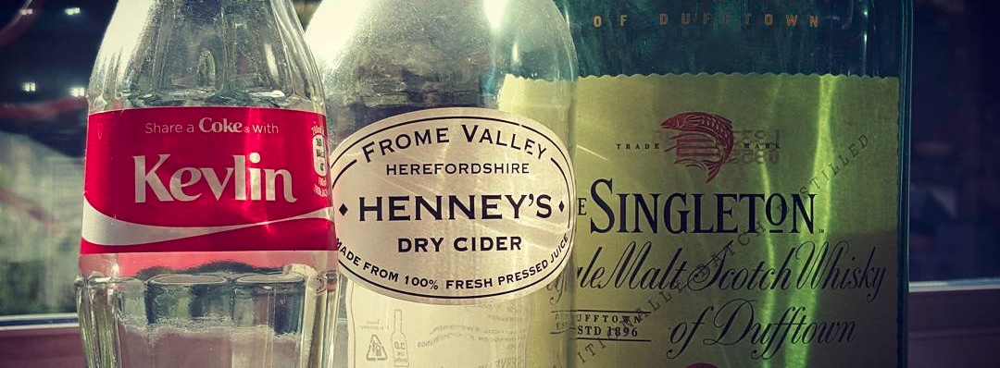

[⬅ Back](./readme.md)

# About me

Hello, I'm Samuele Zanca and I'm a Full Stack Developer.

I'm mostly self-taught, having been introduced to programming by Italy's equivalent to secondary school and soon after my first language/year I was learning languages and technologies on my own.

## Development Experience

## Professional Experience

## Teaching experience 

During High School I've been a teaching assistant for my ex-proferssor, participating in a project to teach middle-schoolers python by making games with pygame.

For about a year now I've been answering career and programming questions mostly related to frontend and backend development over on the [SelfTaught discord](https://discord.gg/fj9CvCs) sever.

I recently started tutoring Java, targeted towards College students who are falling behind due to bad teaching practices.

See my personal [teaching philosophy](philosophy/teaching_philosophy.md) in which I explain some things I dislike about traditional teaching methods.

# My Mentors

## Dylan Israel ([Youtube](https://www.youtube.com/channel/UC5Wi_NYysX-LfcqT3Hq9Faw))
Dylan was a very important mentor figure for me when I decided I wanted to become a web developer. And while I will never understand why he likes to be a carrot farmer, he understands how to write good code and he's got a lot of very good videos on the topic.

Moreover, if you're going the self taught route I would highly recommend listening to this [How to Become a Great Self-taught Developer?](https://www.youtube.com/watch?v=qz20-GYu_38)

Dylan also has a really good dev podcast called [Self-Taught or Not](https://www.selftaughtornot.com/)

## Kelvin Henney ([Twitter](https://twitter.com/KevlinHenney))

Known for his talks related to c++, clean code, [enterprise software](https://www.youtube.com/watch?v=dC9vdQkU-xI) and his Singleton.
Kelvin is a seasoned expert, [thenceforth](https://youtu.be/dC9vdQkU-xI?t=958) he's got a lot of wise knowledge to share.

