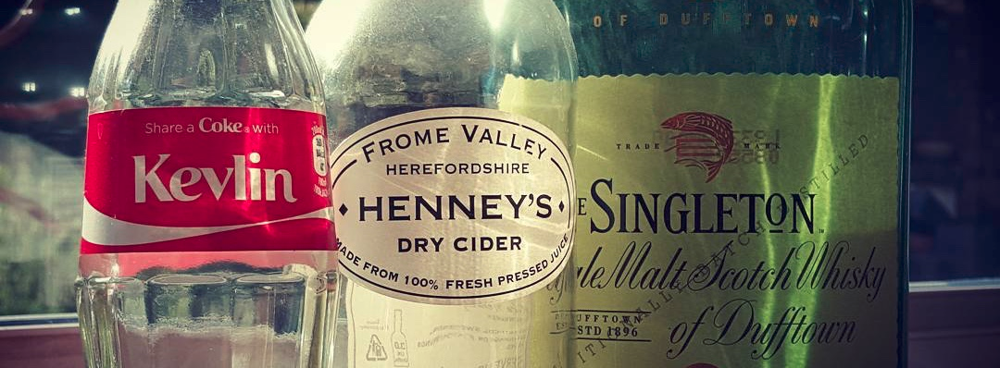

# Samuel's Teaching Curriculum

In this Living Document you'll find my personal notes I use for teaching Software development  

. [Read more about me](about_me.md)

# Teaching Philosophy

My goal as a teacher is not teach "coding in java/python/javascript", my goal is to teach how to think like a Software Developer.

I my opinion:
- A good developer is at least aware of the [Unix Philosophy](philosophy/unix_philosophy.md) and tries to apply it whenever possible to improve the develper experience.
- A good developer is mindful not just of the user experience but also the developer experience.
- A good developer is always learning.
- Keep it simple stupid. -> [A good example of over-engineering](https://www.youtube.com/watch?v=-AQfQFcXac8)

# My Students
(going by their github username for privacy reasons)

- Teaching Java to [kilua1609](https://github.com/metruzanca/Java-Tutoring-Kilua1609)

# Software developers who inspire me

## Dylan Israel
Dylan was a very important mentor figure for me when I decided I wanted to become a web developer. And while I will never understand why he likes to be a carrot farmer, he understands how to write good code and he's got a lot of very good videos on the topic.

Moreover, if you're going the self taught route I would highly recommend listening to this [How to Become a Great Self-taught Developer?](https://www.youtube.com/watch?v=qz20-GYu_38)

Dylan also has a really good dev podcast called [Self-Taught or Not](https://www.selftaughtornot.com/)

## Kelvin Henney ([@KevlinHenney](https://twitter.com/KevlinHenney))

Known for his talks related to c++, clean code, [enterprise software](https://www.youtube.com/watch?v=dC9vdQkU-xI) and his Singleton.
Kelvin is a seasoned expert, [thenceforth](https://youtu.be/dC9vdQkU-xI?t=958) he's got a lot of wise knowledge to share.

